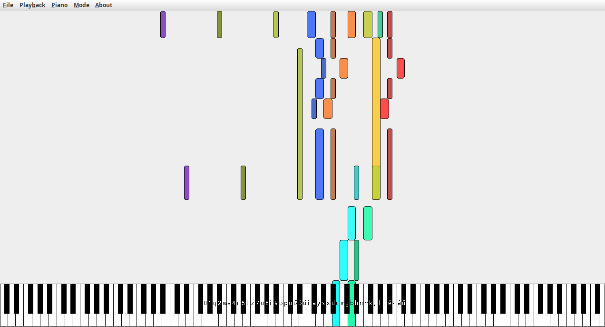
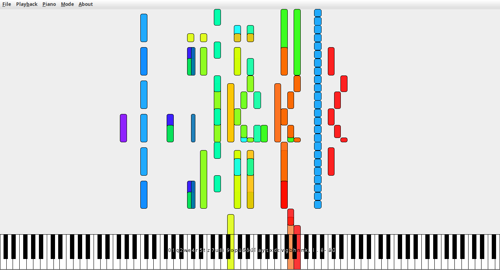

# Synthesijava
A MIDI visualizer written in Java as a homework assignment.

Dokumentáció elérhető [itt](documentation/documentation.md).

Bemutató [videó](https://youtu.be/Lw3OA4XtWHA).

A program letölthető vagy a fájlok közül (a [JAR fájl](synthesijava-1.0.jar)), vagy a [Releases](https://github.com/4321ba/synthesijava/releases) oldalról. Java 17 szükséges a fájl futtatásához.
