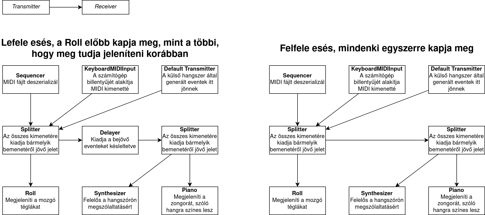

# Adatok

Ezt a programot a BME mérnökinformatikus képzés Programozás alapjai 3. tárgyának nagy házi feladataként készítem.

A program java-ban íródik (OpenJDK 17-et használok), Swinget használ a GUIhoz, és a standard java könyvtárt a MIDI fájlok kezelésére és lejátszására.

A forráskód GPL3 alatt elérhető a [Githubon](https://github.com/4321ba/synthesijava).

# Specifikáció

## Feladat rövid szöveges ismertetése

A feladat egy MIDI-vizualizációs program készítése. A MIDI egy olyan fájlformátum, amiben nem hanghullámok vannak eltárolva, hanem pl. zongora billentyű lenyomás és felengedés. Ez lehetővé tesz olyan vizualizációt, mintha egy tégladarab esne lefelé egyenes vonalú egyenletes mozgással, egy zongora billentyűi felé. Amikor az egyes hanghoz tartozó tégladarab hozzáér a zongorához, akkor kezdődik a hang lejátszása, és amikor a vége is túlesett a zongorán, akkor hagyja abba a hang lejátszását. Ilyen program például eredetileg a [Synthesia](https://synthesiagame.com/), ennek egyszerűsített rekreációja lesz a feladat. Sok hasonló program létezik, valami [ilyesmi](https://youtu.be/aVI7vI_iSGU) a cél (plusz a kért menürendszer).

## Use-case-ek felsorolása és kifejtése

- A felhasználó be tud tölteni MIDI fájlt, hogy azt a program automatikusan lejátssza.
- A számítógépre dugott (külső) MIDI billentyűzethez hozzá lehet csatlakozni a programmal, és akkor az fog látszódni, amit ott real-time játszunk.
- A számítógép billentyűzetén is lehetséges, egyből a programból, hangokat lejátszani.
- Alul látszik a zongorabillentyűzet, felül pedig az a tér, ahol a téglák esnek lefele/felfele.
- Ha real-time lejátszás történik (külső MIDI eszközről, vagy számítógép-billentyűzetről), akkor a téglák lefele esés helyett fölfelé fognak levitálni (azért, mert különben meg kéne jósolni, hogy mit fog a felhasználó lenyomni).
- A felső menübárban találhatók az opciók, és a fájlműveleteket is onnan lehet végrehajtani.
- Lehetőség van a zongora billentyűinek a számát növelni és csökkenteni, bal és jobb oldalon.
- A zongora billentyűk aktuális állapotát el lehet menteni egy saját fájlformátumú fájlba, és onnan vissza lehet tölteni.

## Megoldási ötlet vázlatos ismertetése

A java standard könyvtárának tárháza végtelen, így [található benne](https://docs.oracle.com/javase/tutorial/sound/overview-MIDI.html) alapból MIDI fájl beolvasó függvény, és MIDI fájl lejátszó függvény is. A program lényegi része MIDI Receiverek és Transmitterek implementálásából, és megfelelő összekötéséből fog állni.

Lesz egy Roll nevű osztály, ami képes kirajzolni a lefelé eső / felfelé levitáló téglákat, ő maga egy Receiver, hogy megkapja a kért MIDI üzeneteket (pl. hang lenyomás, hang felengedés), és számon tartja, hogy milyen üzeneteket kapott korábban, hogy ki tudja rajzolni a korábban szólt hangokat is. Alacsony szintű grafikát (Graphics osztályt) használ a megjelenítéshez.

Lesz egy Piano nevű osztály, ami ki tudja rajzolni a billentyűket. Kimentés és visszaolvasás a java-ba beépített szerializációval fog történni, a fájl kiterjesztése `.piano` lesz.

Lesz egy KeyboardMIDIInput nevű osztály, ami a Piano eventjeit dolgozza fel (pl számítógép billentyű lenyomása), és Transmittálja tovább, mintha egy igazi MIDI eszközről jött volna.

Lesz egy késleltető osztály (ha nem találok hasonlót a standard könyvtárban), ami receivel MIDI üzeneteket, és pl. 3 másodperc múlva transmittálja őket. Ez ahhoz kell, hogy a hang ténylegesen akkor szólaljon meg, amikor leért a zongora billentyűihez, viszont a Roll már meg tudja korábban kapni ugyanazt az üzenetet, hogy ki tudja időben rajzolni.

# Programozói dokumentáció

## Függvények dokumentációja

Javadoc kommentekként, a kódban.

## MIDI Transmitterek és Receiverek összekötése
Az ábrán a bal oldali Splittert hívjuk a kódban leftSplitter-nek, és a jobb oldalit rightSplitter-nek (amik között kell a Delayert betenni illetve kivenni).

## Osztálydiagram

Az osztálydiagramon nem jelölöm a java beépített osztályait (így is elég nagy), így az azokat tartalmazó osztályokban a könyvtári osztályok attribútumokként fognak megjelenni. Behúztam egy pár függőséget, de nem az összeset, a függőségek pontos felderítését ajánlatosabb a kód elolvasásával végezni. A beépített osztályokat is asszociációval jelöltem, mivel a modellezőeszközben nem találtam a (+)-os jelölést.

# Felhasználói dokumentáció

A program MIDI vizualizációjára képes. A MIDI egy olyan fájlformátum, amiben nem hanghullámok vannak eltárolva, hanem pl. zongora billentyű lenyomás és felengedés. Ez lehetővé tesz olyan vizualizációt, mintha egy tégladarab esne lefelé, vagy felfelé egyenes vonalú egyenletes mozgással, egy zongora billentyűi felé, vagy felől. Amikor az egyes hanghoz tartozó tégladarab hozzáér a zongorához, akkor kezdődik a hang lejátszása, és amikor a vége is túlesett a zongorán, akkor hagyja abba a hang lejátszását. Ilyen program például eredetileg a [Synthesia](https://synthesiagame.com/), ennek egyszerűsített rekreációja a Synthesijava.

Az adott menüpontok érhetők el a programban (a shortcutot a menü kiírja):

- File > Open MIDI: A felhasználó be tud tölteni MIDI fájlt, hogy azt a program automatikusan lejátssza.
- Playback > Connect / Disconnect External MIDI Device: A számítógépre dugott (külső) MIDI billentyűzethez hozzá lehet csatlakozni a programmal, és akkor az fog látszódni, amit ott real-time játszunk.
- A számítógép billentyűzetén is lehetséges, egyből a programból, hangokat lejátszani, ezt a zongorára kiírt billentyűk lenyomásával lehet.
- Mode menü: Az esés irányát itt lehet változtatni.
- Piano menü: Lehetőség van a zongora billentyűinek a számát növelni és csökkenteni, bal és jobb oldalon.
- File > Load / Save piano settings: A zongora billentyűk aktuális állapotát el lehet menteni egy saját fájlformátumú fájlba, és onnan vissza lehet tölteni.
- Playback > Start / Stop: A MIDI fájl lejátszását megállítja, vagy folytatja. Sajnos a képernyő nem "fagy meg" ennek hatására.

Az ablak szinte tetszőlegesen átméretezhető.

Hiba esetén popup ablak tájékoztatja a felhasználót a hibáról (általában).

